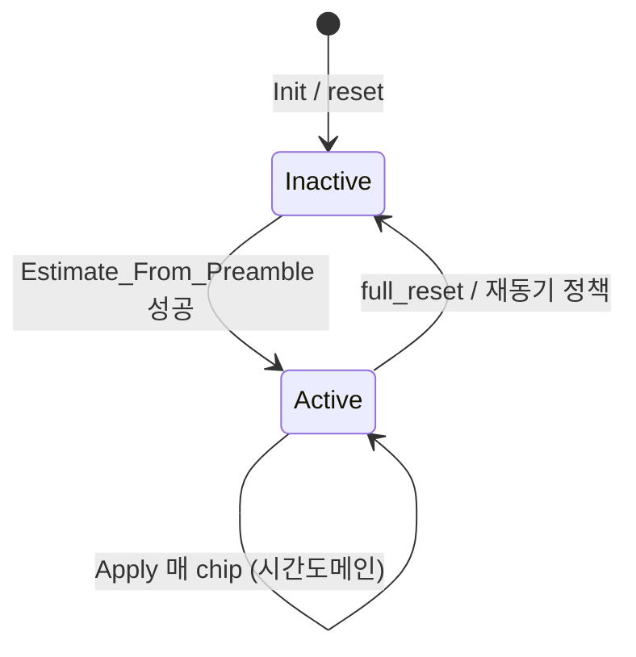

# RX 칩 파이프라인·CFO 통합 설계안

**목적:** `Feed_Chip` 이중 정의·문서/지시 불일치·CFO 적용 위치 논쟁을 **구조적으로** 없애고, S5 CFO 스윕 등 **측정 가능한 회귀 방지**를 전제로 한다.

**범위:** `HTS_V400_Dispatcher::Feed_Chip` 진입부터 `WAIT_SYNC` 버퍼 적재·이후 phase 분기 **이전**까지의 **공통 전처리**와 `HTS_CFO_Compensator` **수명(lifecycle)**. HARQ 코어·페이로드·TX·Decode 로직의 알고리즘 변경은 별도 과제로 둔다.

**전제:** 현재 트리에서 시간도메인 `cfo_.Apply(chip_I, chip_Q)` 는 `Sync_AMI` / `Sync_PSLTE` 의 `Feed_Chip` 에 **이미 존재**하며, `active_` 가드로 Estimate 전에는 no-op 이다.

---

## 1. 현상 정리

### 1.1 빌드·링크 구조 (T6)

- `HTS_T6_SIM_Test.cpp` 말미에서 **단일 TU** 로 여러 `.cpp` 를 `#include` 한다.
- Sync 는 **프로파일당 하나만** 링크된다.

```1537:1542:D:\HTS_ARM11_Firmware\HTS_LIM\HTS_TEST\t6_sim\HTS_T6_SIM_Test.cpp
#if defined(HTS_TARGET_AMI)
#include "../../HTS_LIM/HTS_V400_Dispatcher_Sync_AMI.cpp"
#else
#include "../../HTS_LIM/HTS_V400_Dispatcher_Sync_PSLTE.cpp"
#endif
```

### 1.2 코드 중복

- `HTS_V400_Dispatcher_Sync_AMI.cpp` 와 `HTS_V400_Dispatcher_Sync_PSLTE.cpp` 에 **동일 시그니처**의 `Feed_Chip` 이 각각 정의되어 있다.
- DC IIR → DC 차감 → `cfo_.Apply` → `pre_agc_.Apply` → `apply_holo_lpi_inverse_rx_chip_` 까지는 **양쪽이 동일 패턴**이다(라인 번호만 다름).
- 이후 `WAIT_SYNC` / 홀로 스캔 / MF 등에서 **AMI vs PS-LTE** 분기가 섞이면서 파일이 길어지고, **한쪽만 수정**하는 실수가 구조적으로 가능하다.

### 1.3 지시·운영 충돌

- “**Sync 파일은 건드리지 않는다**”와 “**Feed_Chip 에만 CFO 한 줄을 넣는다**”는 **동시에 만족 불가**하다(`Feed_Chip` 정의가 Sync TU 에만 있기 때문).
- 해결은 **정책을 하나로 줄이거나**, **정의 위치를 바꾸는 것**뿐이다.

---

## 2. 설계 목표 (요구사항)

| ID | 요구 |
|----|------|
| R1 | **DC → CFO → AGC → (프로파일별 후속)** 순서는 **한 구현**에서만 유지·검증한다. |
| R2 | AMI / PS-LTE **차이**는 공통 블록 **밖**으로 밀어, 공통 블록은 **한 번만** 컴파일된다. |
| R3 | CFO: `Init` / `Estimate_From_Preamble` / `Apply` / `Is_Active` 의 **호출 시점**이 문서·단위테스트·(선택) 런타임 assert 로 고정된다. |
| R4 | T6 **매크로 OFF** baseline(AMI·PS-LTE 정량) **비감소** 게이트를 리팩터링마다 통과한다. |
| R5 | S5 CFO 스윕·determinism 은 **회귀 스위트**에 남긴다(이미 운용 중이면 유지). |

**비목표(이 설계안에서 다루지 않음):** Walsh 도메인 CFO 전체 이론 설계, 홀로 Pass2 가설 그리드 튜닝, HARQ 정책 변경.

---

## 3. 권장 아키텍처

### 3.1 공통 전처리 추출 (1차 — 가장 비용 대비 효과 큼)

**아이디어:** `Feed_Chip` 의 **프로파일 무관** 구간을 **별도 헤더/인라인 구현 파일**로 옮기고, 두 Sync 파일에서는 **한 줄 호출**만 남긴다.

```text
rx_chip_preprocess.inl   (또는 .hpp — 네이밍은 팀 규칙에 맞출 것)
  └─ feed_chip_after_rx_iq_(int16_t& chip_I, int16_t& chip_Q) noexcept
       • (선택) AmpDiag / DIAG printf — 기존 #if 그대로
       • DC IIR + DC 차감
       • cfo_.Apply(chip_I, chip_Q)
       • pre_agc_.Apply(chip_I, chip_Q)
       • apply_holo_lpi_inverse_rx_chip_(chip_I, chip_Q, rx_seq_)
```

- **멤버 접근:** `HTS_V400_Dispatcher` 의 `private` 메서드로 두거나, `inl` 을 클래스 정의 **이후**에 include 하여 `this->dc_est_I_` 등으로 접근한다.
- **장점:** CFO 한 줄 누락·순서 뒤바뀜이 **물리적으로 불가능**해진다.
- **단점:** `inl` 이 커지면 빌드 시간 소폭 증가 → 필요 시 DC+CFO+AGC 만 최소 추출.

**대안(2차):** `HTS_V400_Dispatcher_Feed_Chip_Common.cpp` 에 `static` 이 아닌 멤버 함수 `Feed_Chip_Preprocess_()` 를 두고 링크. 단, 현재 **단일 TU include 빌드**와 ARM 쪽 **오브젝트 링크** 방식이 다르면 **한 방식만** 택해 일관성을 유지한다.

### 3.2 정책: “Sync 수정 금지”의 재정의

운영 규칙을 아래 중 **하나**로 명문화한다.

| 정책 | 내용 |
|------|------|
| P-A | **Sync 는 얇게 유지:** Sync 파일에는 `Feed_Chip` 시그니처 + `feed_chip_after_rx_iq_` 호출 + **프로파일별 분기만** 남긴다. “Sync 수정”은 **비즈니스 로직 추가 금지**로 정의한다. |
| P-B | **공통만 코드리뷰 필수:** Sync 내 **공통 블록 길이 0** 을 게이트로 둔다(전부 `inl` 로 이전). |

충돌하던 “Sync 손대지 말 것”과 “Feed_Chip 만 고칠 것”은 **P-A** 로 동시에 만족시킨다.

---

## 4. CFO 서브시스템 수명 (Lifecycle)

### 4.1 상태 모델 (문서·테스트용)



- **`Apply`:** `active_ == false` 이면 **항상 no-op** (현 구현 유지).
- **`Estimate`:** phase0_scan pass 등 **단일 진입점**만 문서에 적는다(지금처럼 여러 경로가 있으면 표로 정리).

### 4.2 “이중 보정” 검증 체크리스트

| 질문 | 확인 방법 |
|------|-----------|
| 홀로/역확산이 **위상을 이미 흡수**하는가? | Pass1/Pass2 출력과 CFO 누적자의 **단위(라디안/칩)** 를 표로 맞춘다. |
| 프리앰블과 페이로드에서 CFO 모델이 **동일**한가? | 페이로드 진입 시 `active_` 로그 또는 단일 프레임 golden trace. |

추가 구현 전 **관측만**으로도 S5 구멍의 상당 부분을 **원인 후보에서 제외**할 수 있다.

### 4.3 장기 옵션 (성능 한계 대응 시)

- **트래킹:** 페이로드 구간에서 느린 CFO 드리프트를 보정하는 **소형 루프**(비용·검증 부담 큼).
- **Walsh 도메인 CFO:** 시간도메인 `Apply` 와 **상호 배타**로 설계(둘 다 켜지 않음). 전환 시 매크로 또는 런타임 플래그 **한 개**로만 제어.

---

## 5. 마이그레이션 단계 (리스크 순)

| 단계 | 작업 | 게이트 |
|------|------|--------|
| M0 | 본 문서를 **단일 소스**로 승인; `CFO_APPLY_RESTORE.md` 에서 “충돌” 절을 링크 | 리뷰 |
| M1 | `rx_chip_preprocess` (이름 가제) 로 **DC+CFO+AGC+holo inverse** 만 이동; Sync 두 파일에서 호출로 치환 | T6 AMI/PS-LTE 빌드 + OFF baseline + S5 샘플 |
| M2 | (선택) DIAG `printf` 를 공통/분리 정리 — **동작 변경 없음** | 동일 |
| M3 | CFO lifecycle 표에 맞춰 **단위 테스트 또는 DIAG 훅** (예: preamble 직후 `Is_Active()` 기대값) | 실패 시 원인 AMI/PS-LTE 공통 vs 전용 구분 용이 |
| M4 | 트래킹/Walsh CFO — **별도 RFC** | 알고리즘 검증 후 |

**롤백:** M1 은 기계적 diff 이므로 `git revert` 한 커밋으로 복구 가능하게 유지한다.

---

## 6. 리스크·완화

| 리스크 | 완화 |
|--------|------|
| `inl` include 순서로 인한 ODR/접근 오류 | 멤버 함수로 두고 `.cpp` 말미가 아닌 **클래스 본문 근처**에 두거나, `friend`/`inline` 멤버로 캡슐화 |
| AMI/PS-LTE 미세 `#if` 차이 | M1 에서는 **완전 동일 블록만** 추출; 한쪽에만 있는 DIAG 는 **호출 전후**에 남김 |
| 펌웨어 vs PC 단일 TU 차이 | ARM 빌드 스크립트에서 동일 `inl` 을 포함하는지 **CI 한 줄**으로 검증 |

---

## 7. 성공 기준 (요약)

1. `Feed_Chip` 의 DC→CFO→AGC→holo inverse **소스 텍스트가 한 곳**에만 존재한다.
2. 지시서 수준의 모순(**“Sync 금지” vs “Feed_Chip만 수정”**)이 **정책 P-A** 로 소거된다.
3. T6 baseline·S5·determinism 게이트 **통과 또는 의도된 변화만** 문서화된다.

---

## 8. 참고 경로 (본 저장소)

- `HTS_LIM/HTS_LIM/HTS_V400_Dispatcher_Sync_AMI.cpp` — `Feed_Chip` (~1418행~)
- `HTS_LIM/HTS_LIM/HTS_V400_Dispatcher_Sync_PSLTE.cpp` — `Feed_Chip` (~1407행~)
- `HTS_LIM/HTS_LIM/HTS_CFO_Compensator.h` — `Apply` 의 `active_` 가드
- `HTS_LIM/CFO_APPLY_RESTORE.md` — 사전 조사·지시서 충돌 기록

---

*문서 버전: 2026-04-22 초안 — 구현 착수 시 M0 승인 후 M1 적용 권장.*
